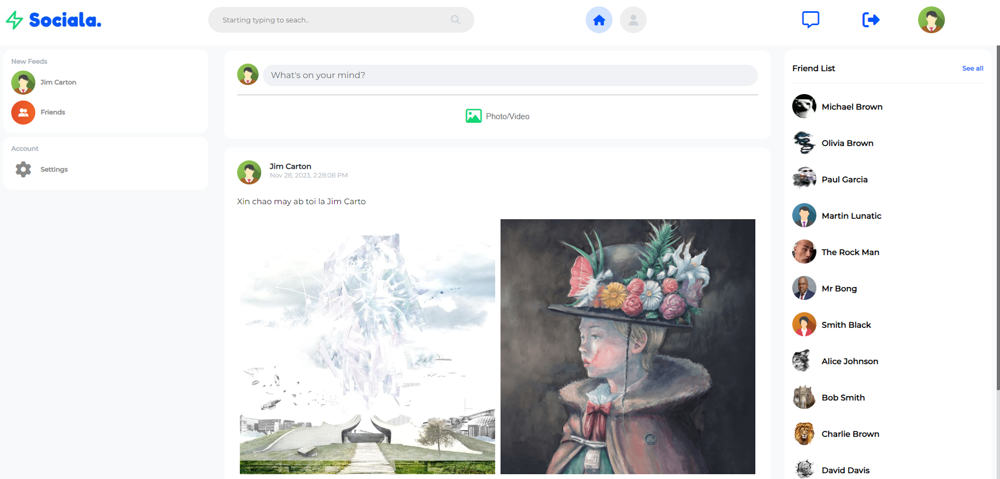
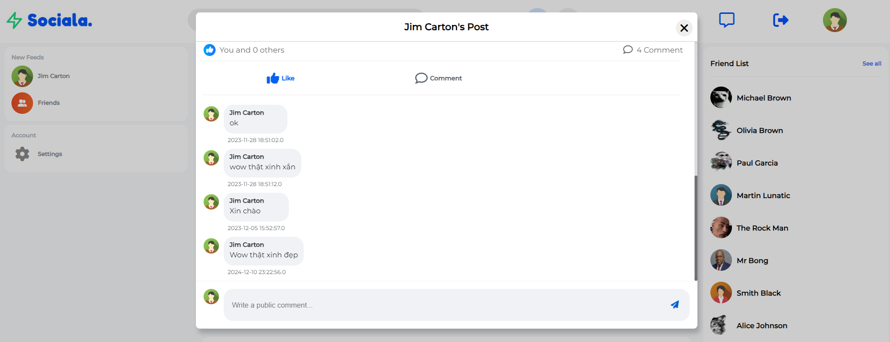
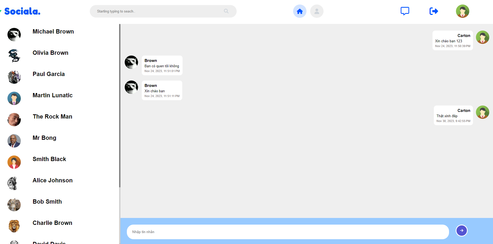

# Social-ME
## Overview
A social network web application built using Java EE for the backend and deployed on an Apache Tomcat container. This application enables users to connect, share updates, and interact with each other through features like user profiles, posts, and comments.

## Features
- User registration and authentication.
- Create, edit, and delete posts.
- Like and comment on posts.
- View and edit user profiles.
- Real time online chat between two users.

## Installation
### Prerequisites
- Java Development Kit (JDK) 
- Apache Tomcat Web Server 10.x
- MySQL
### Installation Steps
- Clone or download the project repository
- Import MySQL Database for the Web Application
- Run Tomcat Server and deploy the pom.xml file stored in the repository
- On the web browser, connect to localhost:8080/mxh to access the Web Page 
## Previews
### Sign In Page

### Home Page

### Post comment section

### Live Message UI
